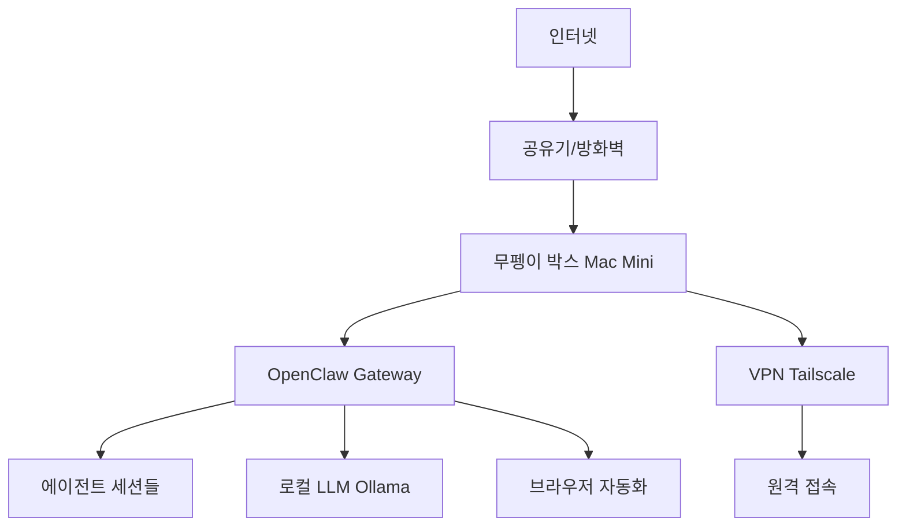

# business-planner

> 사업계획서, 인프라 구조도, 피치덱 자동 생성 스킬  
> v1~v12 반복 수정 경험 내재화 (실전 도약패키지 여정)

---

## 📋 메타데이터

```yaml
name: business-planner
description: "사업계획서, 인프라 구조도, 피치덱 자동 생성. 정부지원(도약패키지/TIPS/창업사관학교), 투자IR, 기술 인프라 설계를 포함. 실전 v1~v12 반복 수정 경험 내재화."
author: 무펭이 🐧
version: 1.0.0
created: 2026-02-14
triggers:
  - "사업계획서"
  - "business plan"
  - "피치덱"
  - "pitch deck"
  - "인프라 구조도"
  - "infrastructure diagram"
  - "도약패키지"
  - "TIPS"
  - "IR 자료"
  - "투자자료"
  - "창업사관학교"
```

---

## 🎯 핵심 기능

### 1. 사업계획서 생성 (정부지원용)

정부 창업지원사업(도약패키지, TIPS, 초기창업패키지, 창업사관학교) 신청용 사업계획서를 자동 생성합니다.

**지원 양식:**
- ✅ 창업도약패키지 (일반형/지역특화형)
- ✅ TIPS (R&D 중심)
- ✅ 초기창업패키지
- ✅ 창업사관학교

**출력 구조:**
```
표지
├─ 신청 및 일반현황
├─ 창업아이템 개요 및 사업화 계획 (요약)
│   ├─ 문제 정의 (후킹)
│   ├─ 솔루션 (제품/서비스)
│   ├─ 고객 사례 (before/after 수치)
│   └─ 핵심 차별점
├─ 시장 분석
│   ├─ TAM/SAM/SOM
│   ├─ 경쟁사 분석
│   └─ 트렌드 (McKinsey, Gartner 등 인용)
├─ 비즈니스 모델
│   ├─ 가격 전략
│   ├─ 유닛 이코노믹스 (CAC, LTV)
│   └─ 수익 구조
├─ 기술 인프라 (있는 경우)
│   ├─ 아키텍처 다이어그램
│   ├─ 하드웨어 스펙
│   └─ 비용 산출
├─ 팀 구성
├─ 재무 계획 (3개년)
│   ├─ 손익계산서
│   ├─ 자금 집행 계획
│   └─ 손익분기점 (BEP)
└─ 로드맵 (Phase 0~4)
```

**출력 형식:**
- HTML (A4 인쇄 최적화, `@media print` 스타일 포함)
- 브라우저에서 열어서 PDF 변환 가능
- 이미지 삽입 가이드 포함 (SVG, PNG, JPG)

---

### 2. 인프라 구조도 생성

기술 기반 스타트업의 인프라 아키텍처를 시각화합니다.

**생성 항목:**
- **아키텍처 다이어그램** (텍스트 기반 ASCII art, Mermaid)
- **하드웨어 스펙 비교표** (Mac Mini, Raspberry Pi, Linux 서버, 클라우드)
- **비용 산출표** (COGS, 간접비, BEP)
- **네트워크 토폴로지** (VPN, 방화벽, 포트 구성)
- **보안 체크리스트** (FileVault, SSH, API 키 격리)

**예시 케이스:**
- 무펭이 박스 (Mac Mini M4 Pro 기반 AI 에이전트 하드웨어)
- 온프레미스 vs 클라우드 vs 하이브리드 비교
- 제품 라인업 (Lite/Pro/Enterprise)

**출력 형식:**
- Markdown (GitHub/Notion 호환)
- Mermaid 다이어그램 (graph, flowchart, sequence)
- ASCII 테이블

---

### 3. 피치덱 생성 (투자 IR용)

투자자/액셀러레이터 대상 피치덱을 10-15장 슬라이드 구조로 생성합니다.

**슬라이드 구조:**
```
1. 표지 (회사명, 한 줄 소개)
2. 문제 (후킹 + 현장 목소리)
3. 솔루션 (제품/서비스 핵심)
4. 시장 규모 (TAM/SAM/SOM, CAGR)
5. 제품 (스크린샷/데모/구조도)
6. 비즈니스 모델 (가격, 유닛 이코노믹스)
7. 트랙션 (PMF 신호, 매출, 사용자)
8. 경쟁 우위 (모트, 차별점)
9. 팀 (창업자, 핵심 인력)
10. 재무 (3개년 예측, 손익분기점)
11. 로드맵 (마일스톤)
12. Ask (필요 자금, 용도, 지분)
```

**스토리텔링 원칙:**
- **후킹 → 의문 해소 → 제품/그림 → 시장/숫자**
- 같은 그림 두 번 사용 금지
- "확산"(네트워크 효과) 강조 — 기술 고도화만 말하지 말 것
- 숫자 중심 (before/after, %, 매출, 사용자)

**출력 형식:**
- Markdown (슬라이드별 섹션 구분)
- Google Slides/PowerPoint 변환 가이드 포함

---

### 4. 반복 수정 지원

버전 관리, 피드백 반영, 이전 버전과 diff 비교를 지원합니다.

**버전 관리:**
- `projects/gov-support/doyak-v1.html` → `v2.html` → ... → `v12.html`
- `git diff` 스타일 변경 추적
- 주요 변경 사항 요약 (`CHANGELOG.md`)

**피드백 반영:**
- 심사위원 코멘트 → 수정 방향 제시
- 투자자 질문 → 보완 섹션 추가
- A/B 테스트 (두 버전 비교)

---

## 🧠 학습된 교훈 (v1~v12 경험)

실전 도약패키지 사업계획서를 v1부터 v12까지 반복 수정하며 얻은 인사이트:

### 스토리텔링

1. **후킹 → 의문 해소 → 제품/그림 → 시장/숫자 순서 지키기**
   - ❌ 나쁜 예: "우리 기술은 AI를 활용해..." (기술 먼저)
   - ✅ 좋은 예: "왜 72%가 AI를 3개월 내 중단할까?" (후킹) → 3대 장벽 제시 → 우리 해결책

2. **같은 그림 두 번 사용 금지**
   - 심사위원이 "이미 본 그림"이라고 느끼면 감점
   - 각 섹션마다 새로운 시각 자료 준비

3. **"확산"이 핵심 — 기술 고도화만 말하지 말 것**
   - ❌ "AI 모델을 더 정확하게 학습시킬 겁니다"
   - ✅ "고객 A의 스킬을 고객 B가 구매 → 네트워크 효과로 가치 증가"

### 프레임워크

4. **무펭이즘 = Apple 비유**
   - OpenClaw = 인터넷 (기반 인프라, 오픈소스)
   - LLM (Claude/GPT) = 반도체 (연산 엔진)
   - 무펭이즘 = Apple (OS + 앱스토어 + 독자 생태계)
   - **메시지**: 기반은 공유하되, 그 위에 독자 생태계를 쌓는다

5. **하드웨어는 판매용이 아니라 우리 인프라**
   - ❌ "랙을 고객에게 판매"
   - ✅ "우리 랙 = 스킬스토어 중앙 서버, AWS 대신 자체 인프라로 마진 확보"

### 수치

6. **Before/After 수치 필수**
   - 견적서 작성: 2시간 → 15분
   - VC 콜드메일 300곳: 1주일 → 2시간
   - SNS 관리: 하루 3시간 → 완전 자동화
   - 맥락 설명 시간: 3개월 후 90% 감소

7. **권위 있는 출처 인용**
   - McKinsey 2025 AI Survey: "기업 AI 도입률 72%, 3개월 내 사용 중단율 72%"
   - Gartner: "2028년까지 에이전틱 AI가 의사결정의 15% 지원"
   - MarketsandMarkets: "AI 에이전트 시장 2025년 $7.84B → 2030년 $52.6B (CAGR 46%)"

---

## 📚 참조 파일

스킬이 자동으로 참조하는 파일들 (workspace 기준):

```
$WORKSPACE/
├─ projects/gov-support/
│   ├─ doyak-v10-img.html (최신 사업계획서 HTML)
│   ├─ doyak-v10-img2.html
│   ├─ doyak-v10.html
│   └─ doyak-v11.pdf (최종 제출본)
├─ memory/consolidated/
│   └─ doyak-business-plan.md (핵심 기억)
├─ memory/
│   ├─ [DATE]-mupeng-box-infra.md (인프라 설계)
│   └─ [DATE]-assoai-pitchdeck.md (피치덱 예시)
└─ memory/research/
    └─ [DATE]-ai-agent-market.md (시장 리서치)
```

---

## 🚀 사용법

### 트리거 키워드

다음 키워드를 포함한 요청 시 자동으로 트리거됩니다:

- **사업계획서**, business plan
- **피치덱**, pitch deck
- **인프라 구조도**, infrastructure diagram
- **도약패키지**, TIPS, 창업사관학교
- **IR 자료**, 투자자료

### 명령어 예시

#### 1. 사업계획서 생성

```
"도약패키지 사업계획서 작성해줘. 회사명은 [회사명], 아이템은 [한 줄 소개]."
```

**생성 프로세스:**
1. 기본 정보 입력 받기 (회사명, 대표자, 사업자번호, 아이템 소개)
2. 참조 파일 읽기 (`doyak-business-plan.md`, 시장 리서치)
3. HTML 템플릿 기반으로 생성 (`doyak-v10-img.html` 구조 참조)
4. 이미지 삽입 가이드 포함
5. `projects/gov-support/[회사명]-v1.html` 저장
6. 브라우저에서 열기 가이드 제공

#### 2. 인프라 구조도 생성

```
"Mac Mini 기반 AI 에이전트 인프라 구조도 만들어줘. 제품 라인업은 Lite/Pro/Enterprise 3종."
```

**생성 프로세스:**
1. `mupeng-box-infra.md` 참조
2. Mermaid 다이어그램 생성 (아키텍처, 네트워크 토폴로지)
3. 하드웨어 스펙 비교표 (Markdown 테이블)
4. 비용 산출표 (COGS, 간접비, BEP)
5. `projects/infra/[프로젝트명]-infra.md` 저장

#### 3. 피치덱 생성

```
"투자자용 피치덱 만들어줘. TAM $2B, SAM $200M, SOM $2M. 현재 고객 2사, ARR 1,680만원."
```

**생성 프로세스:**
1. `assoai-pitchdeck.md` 구조 참조
2. 10-15장 슬라이드 Markdown 생성
3. 스토리텔링 원칙 적용 (후킹 → 의문 해소 → 제품 → 숫자)
4. 숫자 중심 작성 (TAM/SAM/SOM, CAC, LTV, BEP)
5. `projects/pitch/[회사명]-pitchdeck.md` 저장

#### 4. 버전 비교

```
"doyak-v10.html과 v11.html 차이점 알려줘"
```

**실행:**
- 두 파일을 읽어서 주요 변경 사항 요약
- 섹션별 diff 표시
- 개선 방향 제시

#### 5. 피드백 반영

```
"심사위원 피드백: '시장 확산 전략이 약하다'. 이 부분 보완해줘."
```

**실행:**
1. 기존 사업계획서 읽기
2. "확산" 관련 섹션 찾기 (비즈니스 모델, 로드맵)
3. 네트워크 효과, 바이럴 전략 추가
4. `v[N+1].html` 생성
5. 변경 사항 요약

---

## 📐 템플릿 구조

### 사업계획서 HTML 템플릿

```html
<!DOCTYPE html>
<html lang="ko">
<head>
<meta charset="UTF-8">
<title>창업도약패키지(일반형) 사업계획서 — [회사명]</title>
<style>
@page { size: A4; margin: 15mm 10mm; }
@media print {
  body { margin: 0; }
  .page-break { page-break-before: always; }
  .no-break { page-break-inside: avoid; }
}
/* ... 인쇄 최적화 CSS ... */
</style>
</head>
<body>

<!-- 표지 -->
<div class="page">
  <div class="cover-logo">
    <!-- 회사 로고 SVG 또는 이미지 -->
  </div>
  <div class="cover-title">사 업 계 획 서</div>
  <div class="cover-sub">창업도약패키지(일반형)</div>
  <!-- ... -->
</div>

<!-- 신청 및 일반현황 -->
<div class="page page-break">
  <h2>□ 신청 및 일반현황</h2>
  <table>
    <!-- 기본 정보 테이블 -->
  </table>
</div>

<!-- 창업아이템 개요 -->
<div class="page page-break">
  <h2>□ 창업아이템 개요 및 사업화 계획(요약)</h2>
  <h3>제품·서비스 개요: 문제 → 해결 → 제품</h3>
  <h4>◦ 왜 [문제 후킹]?</h4>
  <p>[McKinsey/Gartner 등 권위 출처 인용]</p>
  <ul class="bullet">
    <li><strong>장벽 1. "[제목]"</strong> — [설명]</li>
    <li><strong>장벽 2. "[제목]"</strong> — [설명]</li>
    <li><strong>장벽 3. "[제목]"</strong> — [설명]</li>
  </ul>
  
  <h4>◦ [제품명]는 이 세 가지 장벽을 한 번에 해결합니다</h4>
  <p>[솔루션 한 줄 요약]</p>
  
  <table>
    <tr><th>장벽</th><th>해결 방법</th></tr>
    <!-- before/after 비교 -->
  </table>
  
  <h4>◦ 실제 고객사 사례로 검증된 효과</h4>
  <p><strong>[고객사 A]</strong>는 [제품] 도입 후 "[업무]"를 [before] → [after]로 단축.</p>
</div>

<!-- 시장 분석 -->
<div class="page page-break">
  <h2>□ 시장 분석</h2>
  <table>
    <tr><th>구분</th><th>규모</th><th>산출 근거</th></tr>
    <tr><td>TAM</td><td>$[금액]</td><td>[계산식]</td></tr>
    <tr><td>SAM</td><td>$[금액]</td><td>[계산식]</td></tr>
    <tr><td>SOM</td><td>$[금액]</td><td>[계산식]</td></tr>
  </table>
</div>

<!-- 나머지 섹션들 -->
<!-- ... -->

</body>
</html>
```

### 인프라 구조도 Mermaid 템플릿



### 피치덱 슬라이드 템플릿

```markdown
## 슬라이드 1: 표지

# **[회사명]**
### [한 줄 소개]

> "[후킹 문구]"

- [웹사이트]
- [연락처]

---

## 슬라이드 2: 문제

### [문제 제목]

**현장의 목소리:**

| 고충 | 현실 |
|------|------|
| 🤯 [항목 1] | [설명] |
| 📋 [항목 2] | [설명] |
| 💰 [항목 3] | [설명] |

> **[권위 출처]**: "[인용문]"

---

## 슬라이드 3: 솔루션

### [제품명]

[한 줄 설명]

```
[before]  →  [after]
[수치 1]      [수치 2]
```

**AI가 하는 일:**
- 📌 [기능 1]
- 🔍 [기능 2]
- 📝 [기능 3]

---

[... 나머지 슬라이드들 ...]
```

---

## 🔧 기술 스택

스킬이 내부적으로 사용하는 도구들:

- **HTML 생성**: 템플릿 엔진 (Mustache/Handlebars 스타일)
- **다이어그램**: Mermaid, ASCII art
- **버전 관리**: Git diff 로직
- **PDF 변환**: 브라우저 print API 활용 (사용자가 수동 실행)
- **파일 I/O**: OpenClaw `read`, `write`, `edit` 도구

---

## 📊 출력 예시

### 생성된 파일 구조

```
$WORKSPACE/
└─ projects/
    ├─ gov-support/
    │   ├─ [회사명]-v1.html (초안)
    │   ├─ [회사명]-v2.html (피드백 반영)
    │   └─ [회사명]-final.pdf (최종 제출본)
    ├─ pitch/
    │   └─ [회사명]-pitchdeck.md
    └─ infra/
        └─ [프로젝트명]-infra.md
```

### 이벤트 버스

새 버전 생성 시 이벤트 로그 저장:

```json
{
  "event": "business_plan_created",
  "timestamp": "2026-02-14T08:06:00Z",
  "version": "v1",
  "file": "projects/gov-support/mycompany-v1.html",
  "company": "MyCompany",
  "type": "doyak-package",
  "changes": "초안 생성"
}
```

파일 위치: `events/business-plan-2026-02-14.json`

---

## 🎓 학습 자료

### 추천 읽기

- **도약패키지 신청 가이드**: [K-Startup](https://www.k-startup.go.kr/)
- **TIPS 공고**: [팁스타운](https://www.tipstown.or.kr/)
- **Y Combinator 피치덱 가이드**: [YC Library](https://www.ycombinator.com/library/2u-how-to-build-your-seed-round-pitch-deck)
- **McKinsey AI Survey**: [McKinsey](https://www.mckinsey.com/capabilities/quantumblack/our-insights/the-state-of-ai)

### 내부 참조

- `memory/consolidated/doyak-business-plan.md` — v1~v12 반복 수정 경험
- `memory/2026-02-09-mupeng-box-infra.md` — 인프라 설계 사례
- `memory/research/2026-02-14-ai-agent-market.md` — 시장 조사 데이터

---

## 🐧 Footer

> 🐧 Built by **무펭이** — [무펭이즘(Mupengism)](https://github.com/mupeng) 생태계 스킬  
> 📅 Created: 2026-02-14  
> 📝 Version: 1.0.0  
> 🏷️ Tags: #business-plan #pitch-deck #infrastructure #government-funding #IR

---

## 🔄 업데이트 로그

| 버전 | 날짜 | 변경 사항 |
|------|------|----------|
| 1.0.0 | 2026-02-14 | 초기 버전 생성. v1~v12 경험 내재화 완료 |

---

**라이선스**: MIT  
**기여**: Pull requests welcome at [github.com/mupeng/workspace/skills/business-planner](https://github.com/mupeng/workspace)
